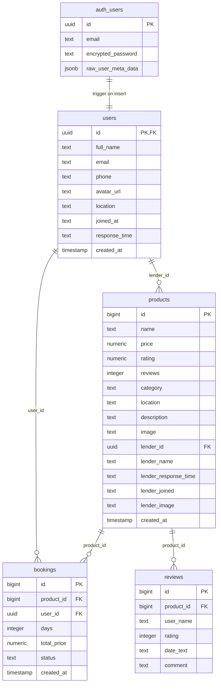

# 🏘️ Sharehood — שכנות משתפת

> פלטפורמה קהילתית להשאלת ציוד בין שכנים

[](https://sharehood-mdek960fi-maya-s-projects24.vercel.app)
[](https://github.com/mayahorn27-ctrl/sharehood)

---

## 🔍 סקירה כללית

**Sharehood** היא פלטפורמת שיתוף ציוד שכונתית המאפשרת לאנשים להשכיר ולשאול פריטים מהשכנים שלהם — במקום לקנות, לזרוק ולצרוך יותר ממה שצריך.

---

## 😖 הבעיה שאנחנו פותרים

כמה פעמים קנית מקדחה / אוהל / עגלת תינוק שהשתמשת בה פעם–פעמיים ואז ישבה לה בארון? רוב הציוד בבתים משמש **פחות מ-5% מהזמן**. מצד שני, כשאנחנו צריכים ציוד מסוים — אנחנו קונים חדש, במקום לשאול ממישהו קרוב שבוודאות כבר יש לו.

הבעיה הקונקרטית: **אין פלטפורמה נגישה, מקומית ובטוחה שמקלה על שיתוף ציוד בין שכנים.**

---

## 🎯 קהל היעד

| סגמנט | מתי הוא משתמש |
|---|---|
| **שוכרים** — אנשים שצריכים ציוד לטווח קצר | לפני אירוע, שיפוץ, טיול, יום הולדת |
| **משאילים** — בעלי ציוד שלא בשימוש | רוצים להרוויח מציוד שממילא מאבק להם |
| **משפחות צעירות** | ציוד תינוקות יקר ולא בשימוש לאורך זמן |
| **שוכרי דירות** | אינם רוצים לקנות ציוד יקר לפני שמחליטים לאן עוברים |

---

## ⚔️ מתחרים ובידול

| מתחרה | חסרון שלו | הבידול שלנו |
|---|---|---|
| **Yad2 / Facebook Marketplace** | מכירה סופית, לא השכרה | Sharehood מתוכנן לשיתוף זמני |
| **קבוצות וואטסאפ שכונתיות** | כאוטי, אין מחיר/חוזה/אמינות | פלטפורמה מסודרת עם ציון, מחיר וקשר ישיר |
| **קנייה חדשה** | יקר, בזבזני, מגדיל פסולת | חיסכון כלכלי + ירוק יותר |
| **Airbnb Experiences** | יקר ומורכב | Sharehood מקומי, פשוט ומהיר |

**הבידול שלנו:** ממשק RTL מלא בעברית, תשלום דרך **Bit ו-PayBox** (הישראלים ביותר), וחוויה שמרגישה כמו "עזרה מהשכן" ולא כמו עסקה קרה.

---

## 🚀 קישור לפרויקט החי

**https://sharehood-mdek960fi-maya-s-projects24.vercel.app**

### 👤 משתמש דמו לבדיקה

אם אינך רוצה להירשם, ניתן ליצור חשבון חינמי ישירות דרך האתר. לצורך בדיקת הזרימה המלאה:
1. גש לאתר → לחץ על **"כניסה / הרשמה"**
2. צור חשבון חדש עם אימייל וסיסמה כלשהם
3. גלוש בין הפריטים, לחץ על פריט → **"הזמן עכשיו"** → עבור לתשלום
4. בחלון "יצירת קשר" יוצג מספר הטלפון האמיתי של המשאיל מהדאטה-בייס

---

## 🗄️ תרשים ERD — מודל הנתונים (Supabase)



### תיאור הטבלאות

| טבלה | תיאור |
|---|---|
| `auth.users` | טבלת המשתמשים הפנימית של Supabase Authentication |
| `public.users` | פרופיל המשתמש הציבורי (שם, טלפון, תמונה, מיקום) — מסונכרנת אוטומטית עם `auth.users` דרך Trigger |
| `public.products` | כל הפריטים להשכרה. `lender_id` מקשר לבעל הפריט בטבלת `users` |
| `public.bookings` | הזמנות ביצוע. מקשרת בין שוכר (`user_id`) למוצר (`product_id`) |
| `public.reviews` | ביקורות על פריטים. מקושרות ל-`product_id` |

---

## 🔌 שירותים חיצוניים ואינטגרציות

| שירות | סוג | תפקיד במוצר |
|---|---|---|
| **Supabase Authentication** | אוטנטיקציה | הרשמה/כניסה של משתמשים עם אימייל וסיסמה. מנהל ה-JWT sessions |
| **Supabase Database (PostgreSQL)** | בסיס נתונים | שמירת כל הנתונים: פריטים, משתמשים, הזמנות וביקורות. כולל RLS (Row Level Security) |
| **Supabase Triggers** | לוגיקת שרת | Trigger אוטומטי שיוצר רשומה ב-`public.users` בכל פעם שמשתמש נרשם ל-Auth |
| **Vercel** | Hosting / CI/CD | אחסון וסביבת הרצה לגרסת הפרודקשן. מבצע Deploy אוטומטי בכל push ל-GitHub |
| **GitHub** | Version Control | ניהול גרסאות הקוד ו-CI/CD trigger ל-Vercel |
| **Unsplash** | מדיה | תמונות מוצרים (CDN ציבורי, ללא API key) |
| **ui-avatars.com** | מדיה | יצירת תמונות אווטאר אוטומטיות על בסיס שם המשתמש |

---

## 🏗️ ארכיטקטורה וטכנולוגיות

| שכבה | טכנולוגיה |
|---|---|
| **Frontend** | React 18 + Vite |
| **Routing** | React Router v6 |
| **Styling** | Tailwind CSS |
| **Icons** | Lucide React |
| **Backend** | Supabase (PostgreSQL + Auth + Realtime) |
| **Deployment** | Vercel |

---

## 🖥️ הרצה מקומית

```bash
# שכפל את הריפו
git clone https://github.com/mayahorn27-ctrl/sharehood.git
cd sharehood

# התקן תלויות
npm install

# צור קובץ .env
cp .env.example .env
# ערוך את .env עם מפתחות ה-Supabase שלך

# הרץ את שרת הפיתוח
npm run dev
```

### משתני סביבה נדרשים (`.env`):
```
VITE_SUPABASE_URL=your_supabase_project_url
VITE_SUPABASE_ANON_KEY=your_supabase_anon_key
```

---

## ✨ פיצ'רים עיקריים

- 🔐 **הרשמה והתחברות** מאובטחת דרך Supabase Auth
- 🏠 **לוח ציוד דינמי** — 40+ פריטים מהדאטה-בייס, סינון לפי קטגוריה וחיפוש חופשי
- 📋 **עמוד פרטי מוצר** עם ביקורות, פרטי משאיל ויצירת קשר ישירה
- 📞 **יצירת קשר** — טלפון ואימייל אמיתיים של המשאיל מהדאטה-בייס
- 💸 **תשלום ישראלי** — Bit / PayBox (לא כרטיס אשראי)
- ➕ **העלאת פריט** — כל פריט שמועלה נשמר מיד ל-Supabase
- 📱 **מותאם למובייל** ומוגדר RTL מלא
